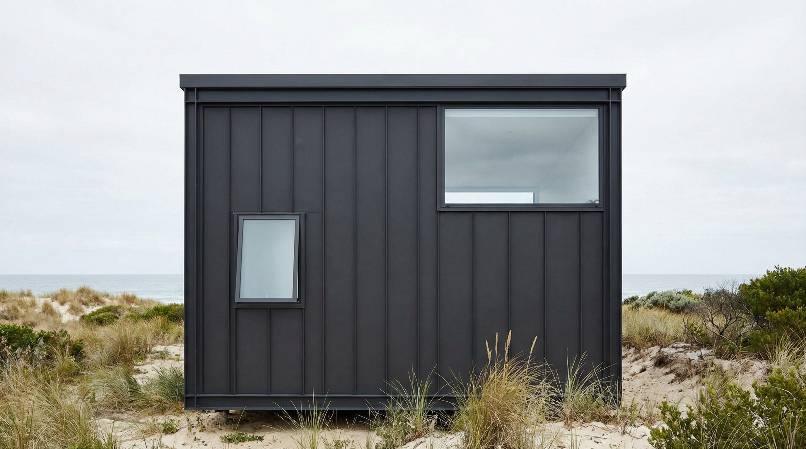
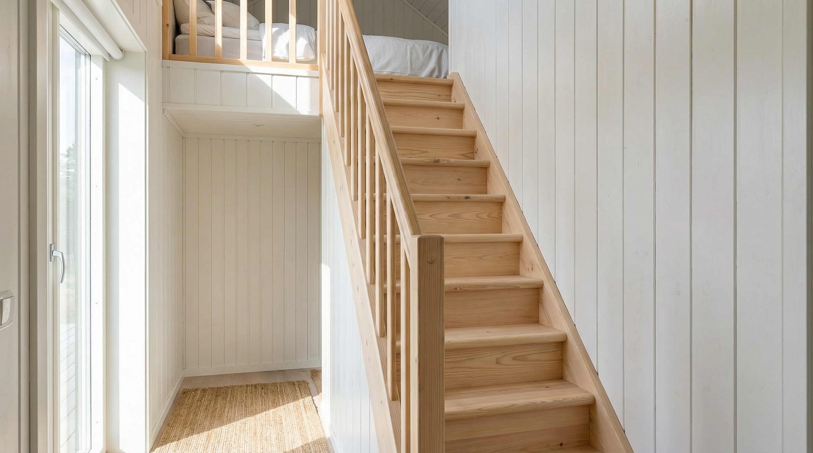
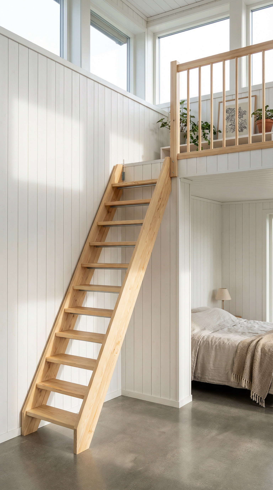
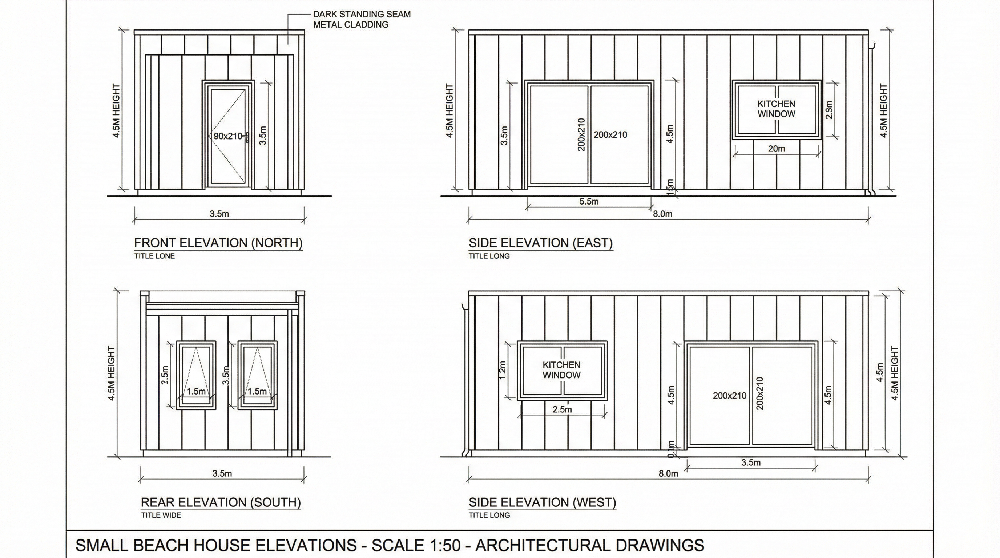
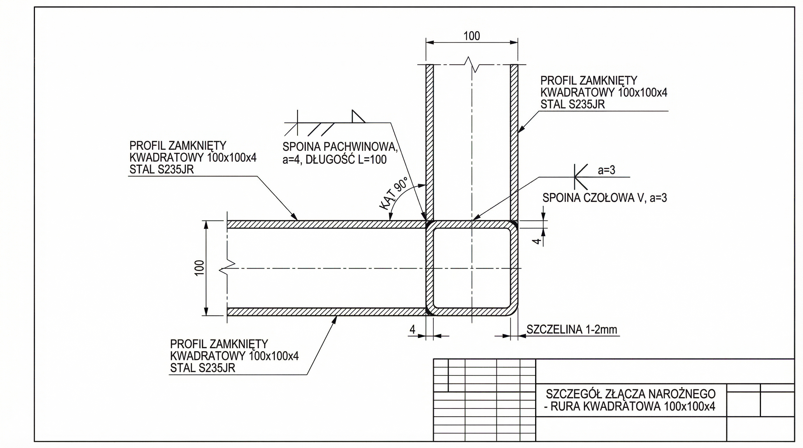
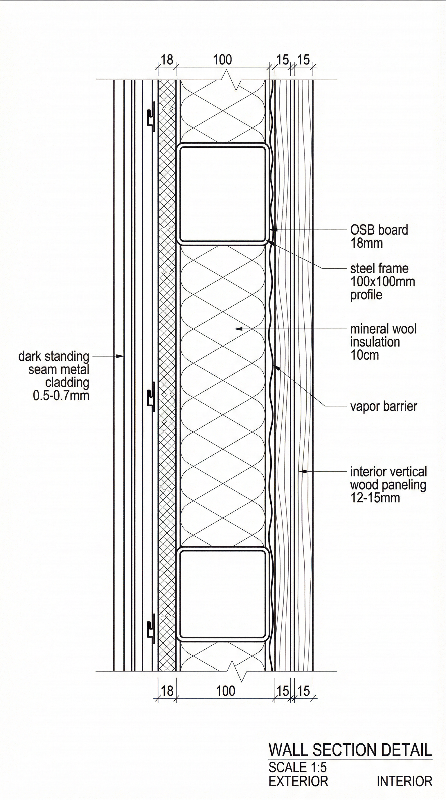

# Projekt architektoniczny domku rekreacyjnego nad morzem

**Wersja finalna z kompletną dokumentacją, obliczeniami i wizualizacjami**

- **Lokalizacja**: Błota Karwieńskie
- **Inwestor**: Ewelina i Paweł Urbańscy
- **Data opracowania**: Luty 2026 (Wersja 3.0)
- **Opracował**: Manus AI

---

## Spis treści

1.  [Podsumowanie zmian i review](#podsumowanie)
2.  [Dane techniczne i bilans powierzchni](#dane-techniczne)
3.  [Opis architektoniczny i funkcjonalny](#opis-architektoniczny)
4.  [Wizualizacje realistyczne - Elewacje zewnętrzne](#wizualizacje-zewnetrzne)
5.  [Wizualizacje realistyczne - Wnętrza](#wizualizacje-wnetrza)
6.  [Schematy techniczne - Rzuty i przekroje](#schematy-techniczne)
7.  [Schematy konstrukcyjne](#schematy-konstrukcyjne)
8.  [Uproszczone obliczenia konstrukcyjne (dla początkującego)](#obliczenia-konstrukcyjne)
9.  [Szczegółowe obliczenia masy całkowitej](#obliczenia-masy)
10. [Systemy budynku: Wentylacja, Ogrzewanie, Odwodnienie](#systemy-budynku)

---

## 1. Podsumowanie zmian i review (Wersja 2.0) {#podsumowanie}

Zgodnie z prośbą, przeprowadzono szczegółowy przegląd kompletności i spójności projektu. Wprowadzono następujące kluczowe korekty i uzupełnienia:

-   **Dodano obliczenia konstrukcyjne**: Do projektu dołączono nową sekcję z uproszczonymi obliczeniami wytrzymałościowymi dla kluczowych elementów (belki stropowe, słupy nośne), wraz z przystępnym wyjaśnieniem dla początkującego. Obliczenia potwierdziły, że zaproponowana konstrukcja jest w pełni bezpieczna i posiada odpowiedni zapas nośności.
-   **Skorygowano wysokości budynku**: Poprawiono niespójności w wysokościach. Ustalono nową, realną wysokość budynku na **4,65 m**, co pozwala zachować komfortową wysokość parteru (2,30 m) i uzyskać minimalną wymaganą wysokość na antresoli (1,90 m).
-   **Poprawiono opis antresoli**: Usunięto błędny opis o "skośnym suficie". Antresola ma **płaski sufit** na stałej wysokości ok. 1,90 m, co wynika z płaskiej konstrukcji dachu.
-   **Urealniono bilans powierzchni**: Zaktualizowano obliczenia powierzchni użytkowej, która po uwzględnieniu grubości ścian i dodaniu powierzchni antresoli wynosi **ok. 33,5 m²**.
-   **Dodano opis systemów budynku**: Uzupełniono projekt o kluczowe informacje dotyczące wentylacji, ogrzewania oraz systemu odwodnienia dachu płaskiego.
-   **Zapewniono spójność**: Zweryfikowano opisy, schematy i wizualizacje, aby zapewnić ich wzajemną zgodność.

---

## 2. Dane techniczne i bilans powierzchni (poprawione) {#dane-techniczne}

| Parametr | Wartość (po korekcie) | Uwagi |
| :--- | :--- | :--- |
| **Wymiary zewnętrzne** | 3,50 m × 8,00 m | Bez zmian |
| **Powierzchnia zabudowy** | 28,00 m² | Bez zmian |
| **Wysokość budynku** | **~4,65 m** | Zmieniono z 4,50 m, aby uzyskać wymagane wysokości wewnętrzne |
| **Wysokość parteru (w świetle)** | 2,30 m | Bez zmian |
| **Wysokość antresoli (w świetle)** | **~1,90 m** | Poprawiono z "1,90-2,20 m", sufit jest płaski |
| **Powierzchnia użytkowa parteru** | **~24,5 m²** | Urealniono po odjęciu grubości ścian |
| **Powierzchnia użytkowa antresoli** | 9,00 m² | Bez zmian |
| **Łączna powierzchnia użytkowa** | **~33,5 m²** | Zmieniono z 28 m² |
| **Technologia budowy** | Szkielet stalowy | Bez zmian |

---

## 3. Opis architektoniczny i funkcjonalny (zaktualizowany) {#opis-architektoniczny}

### 3.1. Opis bryły architektonicznej

Budynek charakteryzuje się prostą, prostopadłościenną bryłą o wymiarach 3,50 m × 8,00 m i wysokości **4,65 m**. Płaski dach podkreśla nowoczesny charakter obiektu. Elewacja została zaprojektowana z wykorzystaniem ciemnoszarej blachy na rąbek stojący, co nadaje budynkowi elegancki i ponadczasowy wygląd.

### 3.2. Układ funkcjonalno-przestrzenny

#### Parter (ok. 24,5 m²)

Parter stanowi otwartą przestrzeń dzienną o wysokości **2,30 m**. W jej skład wchodzą:
-   **Strefa wypoczynkowa** z dużym oknem fix 200×210 cm.
-   **Aneks kuchenny** o długości 2,5 m.
-   **Łazienka** o powierzchni 3 m².
-   **Schody młynarskie Dolle Normandie** prowadzące na antresolę.

#### Antresola (9 m²)

Antresola o wymiarach 3,0 m × 3,0 m pełni funkcję sypialni. Jej wysokość w świetle wynosi **ok. 1,90 m**, co pozwala na swobodne poruszanie się w pozycji lekko pochylonej. Przestrzeń ta pomieści podwójne łóżko oraz szafki nocne. Zostanie zabezpieczona balustradą o wysokości 110 cm.

---

## 4. Wizualizacje realistyczne - Elewacje zewnętrzne {#wizualizacje-zewnetrzne}

### Elewacja frontowa

*Elewacja frontowa prezentuje główne wejście do budynku. Drzwi wejściowe o wymiarach 90×210 cm zostały umieszczone centralnie na krótszej ścianie. Elewacja wykończona jest ciemnografitową blachą na rąbek stojący, która nadaje budynkowi nowoczesny i elegancki charakter.*

### Elewacja boczna długa (widokowa)

*Główna elewacja widokowa z dużym przeszkleniem typu fix o wymiarach 200×210 cm. Okno to zapewnia panoramiczny widok na otaczający krajobraz oraz maksymalne doświetlenie strefy dziennej. Widoczne jest również niewielkie okno antresoli w górnej części ściany.*

### Perspektywa zewnętrzna (3/4)

*Widok perspektywiczny budynku ukazuje jego prostopadłościenną bryłę oraz harmonijne wkomponowanie w nadmorski krajobraz. Płaski dach podkreśla minimalistyczny charakter obiektu.*

### Widok z lotu ptaka

*Widok z góry ukazuje płaski dach pokryty ciemną membraną hydroizolacyjną oraz prostokątną bryłę budynku o wymiarach 3,5 m × 8,0 m.*

### Elewacja tylna

*Elewacja tylna z dwoma oknami: małym oknem łazienkowym (60×90 cm) z matowym szkłem oraz większym oknem antresoli (150×90 cm) umieszczonym wyżej.*

### Widok nocny

*Wizualizacja nocna pokazuje budynek oświetlony od wewnątrz. Ciepłe światło wydobywające się przez duże przeszklenie tworzy przytulną atmosferę.*

---

## 5. Wizualizacje realistyczne - Wnętrza {#wizualizacje-wnetrza}

### Strefa dzienna (salon)

*Przestrzeń dzienna utrzymana w skandynawskim stylu z białymi, pionowymi deskami boazeryjnymi na ścianach. Duże panoramiczne okno zapewnia doskonałe doświetlenie oraz widok na morze.*

### Aneks kuchenny

*Kompaktowy aneks kuchenny o długości 2,5 m z jasnymi szafkami i drewnianym blatem roboczym. Okno nad blatem (120×90 cm) zapewnia doświetlenie i wentylację.*

### Schody młynarskie

*Schody Dolle Normandie z podstopniami wykonane z drewna świerkowego. Kąt nachylenia 53° oraz głębokość stopnia 19 cm zapewniają komfortowe i bezpieczne użytkowanie.*

### Antresola - sypialnia

*Przytulna sypialnia na antresoli o wymiarach 3×3 m z podwójnym łóżkiem i szafkami nocnymi. Płaski sufit na wysokości ok. 1,90 m.*

### Łazienka

*Kompaktowa łazienka o wymiarach 1,5×2,0 m z kabiną prysznicową (80×80 cm), umywalką ścienną i toaletą.*

### Widok w górę na antresolę

*Widok z parteru w górę pokazuje schody prowadzące na antresolę oraz drewnianą balustradę zabezpieczającą krawędź loftu.*

---

## 6. Schematy techniczne - Rzuty i przekroje {#schematy-techniczne}

### Rzut parteru (skala 1:50)

*Szczegółowy rzut parteru z wymiarami wszystkich pomieszczeń i elementów. Widoczne są: strefa wypoczynkowa, aneks kuchenny, łazienka i schody.*

### Rzut antresoli (skala 1:50)

*Rzut poziomu antresoli pokazujący przestrzeń sypialnianą 3,0×3,0 m, umiejscowienie łóżka, balustradę oraz otwór schodowy.*

### Przekrój poprzeczny (skala 1:50)

*Przekrój budynku pokazujący wysokości: parteru (2,30 m), antresoli (1,90 m) oraz całkowitą (4,65 m). Widoczne są również warstwy ścian, dachu i podłogi.*

### Elewacje wszystkie (skala 1:50)

*Zestaw czterech elewacji z wymiarami, wskazaniem materiałów (blacha na rąbek stojący) oraz wysokością budynku 4,65 m.*

---

## 7. Schematy konstrukcyjne {#schematy-konstrukcyjne}

### Szkielet stalowy - widok izometryczny

*Izometryczny widok kompletnego szkieletu stalowego pokazujący ramy fundamentową, stropu i dachu, 8 słupów nośnych oraz belki poprzeczne. Wszystkie profile 100×100 mm.*

### Detal połączenia spawanego

*Szczegółowy rysunek techniczny pokazujący sposób spawania profili zamkniętych 100×100×4 mm, z oznaczeniem spoin pachwinowych i materiału (Stal S235JR).*

### Detal warstw ściany (skala 1:5)

*Przekrój przez ścianę zewnętrzną z dokładnym przedstawieniem warstw: blacha na rąbek, płyta OSB 18 mm, profil stalowy 100×100 mm z wełną mineralną 10 cm, folia paroizolacyjna, boazeria pionowa.*

### Aksonometria budynku z rozłożeniem warstw

*Izometryczny widok budynku z częściowym rozłożeniem warstw pokazujący kompletną konstrukcję stalową, wszystkie pomieszczenia oraz warstwy ścian, dachu i stropu.*

### Schemat eksplodowany - warstwy konstrukcyjne

*Schemat przedstawiający rozłożone na czynniki pierwsze warstwy konstrukcyjne budynku, od fundamentów aż po pokrycie dachowe.*

---

## 8. Uproszczone obliczenia konstrukcyjne (dla początkującego) {#obliczenia-konstrukcyjne}

**Cel**: Potwierdzenie, że zaproponowane profile stalowe 100x100 mm są wystarczające do przeniesienia obciążeń.

**Wyjaśnienie dla początkującego**: Każdy budynek musi bezpiecznie przenieść swój ciężar oraz dodatkowe obciążenia (śnieg, wiatr, ludzie) na fundamenty. Sprawdzamy, czy belki i słupy nie zegną się ani nie złamią pod wpływem tych sił. Kluczowe jest, aby **naprężenia** (wewnętrzne siły w materiale) były mniejsze niż **wytrzymałość** materiału (dla stali S235JR jest to 235 MPa).

### Krok 1: Zestawienie obciążeń

Musimy zsumować wszystkie siły działające na budynek.

#### 1. Obciążenia stałe (ciężar własny konstrukcji)

| Element | Obciążenie [kN/m²] | Wyjaśnienie |
| :--- | :--- | :--- |
| **Dach** | 0,65 | Papa, 2xOSB, wełna 10cm, blacha, konstrukcja stalowa |
| **Strop antresoli** | 0,75 | Panele, OSB, wełna, konstrukcja stalowa |
| **Ściany zewnętrzne** | 0,50 | Blacha, OSB, wełna 10cm, deski, konstrukcja stalowa |

#### 2. Obciążenia zmienne (użytkowe)

| Element | Obciążenie [kN/m²] | Wyjaśnienie |
| :--- | :--- | :--- |
| **Strop antresoli** | 2,0 | Ludzie, meble (zgodnie z normą PN-EN 1991-1-1) |
| **Dach** | 0,75 | Dostęp serwisowy, konserwacja |

#### 3. Obciążenia klimatyczne (śnieg i wiatr)

Lokalizacja: Błota Karwieńskie (strefa przybrzeżna)

| Element | Obciążenie [kN/m²] | Wyjaśnienie |
| :--- | :--- | :--- |
| **Obciążenie śniegiem (dach)** | 0,96 | Strefa śniegowa III, teren wystawiony na działanie wiatru |
| **Obciążenie wiatrem (ściany)** | 0,65 | Strefa wiatrowa I, teren otwarty (kategoria II) |

### Krok 2: Sprawdzenie belki stropu antresoli (najbardziej obciążony element)

Sprawdzamy belkę o największej rozpiętości (3,0 m) pod antresolą.

**Wyjaśnienie**: Belka musi przenieść ciężar podłogi, mebli i ludzi. Obliczamy całkowitą siłę działającą na 1 metr bieżący belki, a następnie maksymalny moment zginający (siłę, która chce ją zgiąć w połowie).

-   **Rozstaw belek**: co 60 cm (0,6 m)
-   **Obciążenie stałe na belkę**: 0,75 kN/m² * 0,6 m = 0,45 kN/m
-   **Obciążenie użytkowe na belkę**: 2,0 kN/m² * 0,6 m = 1,20 kN/m
-   **Łączne obciążenie obliczeniowe** (z współczynnikami bezpieczeństwa 1.35 dla stałych i 1.5 dla zmiennych):
    `q = 1,35 * 0,45 + 1,5 * 1,20 = 0,61 + 1,80 = 2,41 kN/m`
-   **Maksymalny moment zginający** (dla belki swobodnie podpartej):
    `M_max = (q * L²) / 8 = (2,41 * 3,0²) / 8 = 2,71 kNm`
-   **Sprawdzenie nośności profilu 100x100x4 mm**:
    -   Wskaźnik wytrzymałości na zginanie `W_pl,y` = 35,33 cm³
    -   Nośność na zginanie: `M_c,Rd = 35,33 cm³ * 235 MPa = 8302 Nm = 8,3 kNm`
-   **Warunek nośności**:
    `M_max (2,71 kNm) ≤ M_c,Rd (8,3 kNm)`
    **WARUNEK SPEŁNIONY!** Belka ma ponad 3-krotny zapas nośności.

### Krok 3: Sprawdzenie słupa nośnego (najbardziej obciążony)

Sprawdzamy słup narożny, który przenosi obciążenia z dachu i stropu.

**Wyjaśnienie**: Słup jest ściskany przez siły z góry. Musimy sprawdzić, czy pod wpływem tej siły nie zostanie zgnieciony lub nie wygnie się na bok (tzw. wyboczenie).

-   **Powierzchnia zbierania obciążeń przez słup**: ok. (4,0/2) * (3,5/2) = 3,5 m²
-   **Siła od dachu** (śnieg + ciężar własny):
    `(0,65 + 0,96) kN/m² * 3,5 m² = 5,64 kN`
-   **Siła od stropu antresoli** (użytkowe + ciężar własny):
    `(0,75 + 2,0) kN/m² * 3,5 m² = 9,63 kN`
-   **Łączna siła ściskająca obliczeniowa**:
    `N_Ed = 1,35 * (5,64) + 1,5 * (9,63) = 7,61 + 14,45 = 22,06 kN`
-   **Sprawdzenie nośności na wyboczenie** (uproszczone):
    -   Długość wyboczeniowa `L_cr` = 4,65 m (poprawiona wysokość)
    -   Smukłość `λ` ~ 125
    -   Współczynnik wyboczeniowy `χ` ~ 0,42
    -   Nośność na wyboczenie: `N_b,Rd = χ * A * fy / γ_M1 = 0,42 * 14,8 * 235 / 1,1 = 1328 kN`
-   **Warunek nośności**:
    `N_Ed (22,06 kN) ≤ N_b,Rd (1328 kN)`
    **WARUNEK SPEŁNIONY!** Słup ma ogromny zapas nośności na wyboczenie.

### Wnioski z obliczeń

1.  **Belki stropu antresoli (profil 100x100x4 mm)**: Posiadają ponad 3-krotny zapas nośności. Są w pełni bezpieczne.
2.  **Słupy nośne (profil 100x100x4 mm)**: Posiadają bardzo duży zapas nośności na ściskanie i wyboczenie. Konstrukcja jest stabilna i bezpieczna.
3.  **Belki dachowe i podłogowe**: Ze względu na mniejsze obciążenia (dach) lub podobne (podłoga) w stosunku do stropu antresoli, profil 100x100x4 mm jest również w pełni wystarczający.

**Podsumowanie dla początkującego**: Zaproponowana konstrukcja stalowa z profili 100x100x4 mm jest **bardzo solidna i bezpieczna**. Zastosowane profile mają duży zapas wytrzymałości, co gwarantuje, że budynek bez problemu przeniesie ciężar własny, obciążenie śniegiem i wiatrem typowe dla polskiego wybrzeża, a także obciążenie użytkowe wynikające z normalnego mieszkania.

---

## 9. Szczegółowe obliczenia masy całkowitej {#obliczenia-masy}

**Cel**: Precyzyjne oszacowanie całkowitej masy budynku, co jest kluczowe dla transportu oraz projektowania fundamentów.

**Wyjaśnienie dla początkującego**: Obliczyliśmy masę każdego elementu budynku, od stalowej ramy, przez płyty OSB, izolację, aż po najmniejsze detale jak śruby czy farba (w uproszczeniu). Sumując te wartości, otrzymujemy całkowitą masę konstrukcji, którą trzeba będzie posadowić na gruncie.

### Podsumowanie masy całkowitej

Poniższa tabela przedstawia zestawienie mas poszczególnych komponentów budynku oraz ich procentowy udział w masie całkowitej.

| Kategoria | Masa [kg] | Udział [%] | Wyjaśnienie |
| :--- | :--- | :--- | :--- |
| **Płyty OSB** | 2,538.0 | 34.8% | Najcięższy element; poszycie ścian, dachu i podłóg. |
| **Konstrukcja stalowa** | 1,808.5 | 24.8% | Szkielet nośny budynku (profile 100x100mm). |
| **Wykończenie wewnętrzne** | 1,287.8 | 17.7% | Boazeria, panele, płytki w łazience. |
| **Izolacja (wełna mineralna)** | 554.4 | 7.6% | Ocieplenie ścian, dachu i podłogi. |
| **Elewacja (blacha na rąbek)** | 391.6 | 5.4% | Zewnętrzne pokrycie ścian. |
| **Stolarka okienna i drzwiowa** | 197.0 | 2.7% | Okna i drzwi. |
| **Instalacje i wyposażenie** | 180.0 | 2.5% | Instalacje elektryczne, wod-kan, ceramika sanitarna. |
| **Pokrycie dachu (papa)** | 140.0 | 1.9% | Hydroizolacja dachu płaskiego. |
| **Pozostałe elementy** | 194.6 | 2.6% | Folie, schody, balustrada, obróbki blacharskie. |
| **SUMA** | **7,291.8** | **100.0%** | - |

### Wnioski z obliczeń masy

-   **Masa całkowita budynku (bez mebli i wyposażenia ruchomego) wynosi ok. 7,3 tony.**
-   Masa jednostkowa konstrukcji wynosi ok. **260 kg/m²** powierzchni zabudowy.
-   Największy udział w masie mają płyty OSB (prawie 35%) oraz konstrukcja stalowa (prawie 25%). Razem te dwa komponenty stanowią 60% masy całego obiektu.
-   Obciążenie na jeden punkt fundamentowy (przy 8 punktach podparcia) wynosi ok. **900 kg** (8,94 kN), co pozwala na zastosowanie prostych i tanich fundamentów punktowych (np. bloczków betonowych lub stóp fundamentowych).

---

## 10. Systemy budynku: Wentylacja, Ogrzewanie, Odwodnienie {#systemy-budynku}

### 10.1. Wentylacja

Ze względu na wysoką szczelność nowoczesnych budynków, kluczowe jest zapewnienie odpowiedniej wentylacji. Proponuje się zastosowanie **wentylacji grawitacyjnej** wspomaganej przez nawiewniki okienne oraz wentylator mechaniczny w łazience.

-   **Nawiewniki okienne**: Montowane w górnej części ram okiennych w pokoju dziennym i sypialni na antresoli. Zapewnią stały, kontrolowany dopływ świeżego powietrza.
-   **Wentylator w łazience**: Wentylator osiowy o wydajności min. 50 m³/h, uruchamiany wraz z włączeniem światła lub osobnym włącznikiem. Będzie on usuwał wilgotne i zanieczyszczone powietrze na zewnątrz.
-   **Okna**: Regularne wietrzenie poprzez otwieranie okien jest zalecane w celu szybkiej wymiany powietrza.

### 10.2. Ogrzewanie

Jako główne źródło ciepła proponuje się **ogrzewanie elektryczne** ze względu na prostotę montażu, niskie koszty inwestycyjne i możliwość precyzyjnej kontroli temperatury.

-   **Grzejniki konwektorowe**: Dwa grzejniki elektryczne ścienne o mocy ok. 1000-1500 W każdy, zamontowane na parterze (np. pod oknem w salonie i w aneksie kuchennym). Wyposażone w termostaty, pozwolą na efektywne zarządzanie temperaturą.
-   **Grzejnik drabinkowy w łazience**: Elektryczny grzejnik drabinkowy o mocy ok. 300-500 W, pełniący również funkcję suszarki do ręczników.
-   **Ogrzewanie antresoli**: Ciepłe powietrze z parteru będzie naturalnie unosić się do góry, dogrzewając antresolę. W razie potrzeby można zainstalować tam dodatkowy mały grzejnik o mocy 500 W.

### 10.3. Odwodnienie dachu płaskiego

Dach płaski wymaga precyzyjnego systemu odprowadzania wody opadowej.

-   **Spadek dachu**: Konstrukcja dachu zostanie wykonana z minimalnym spadkiem (1-2%) w kierunku jednej z dłuższych ścian budynku.
-   **Rynna**: Na krawędzi dachu, do której skierowany jest spadek, zostanie zamontowana rynna (np. system rynien ukrytych lub tradycyjna rynna stalowa w kolorze elewacji).
-   **Rura spustowa**: Woda z rynny będzie odprowadzana rurą spustową, poprowadzoną w narożniku budynku. Rura będzie podłączona do systemu rozsączania wody deszczowej na działce (np. skrzynki rozsączające) lub odprowadzana powierzchniowo z dala od fundamentów.
