# Projekt architektoniczny domku rekreacyjnego nad morzem
## Wersja finalna z obliczeniami i wizualizacjami

**Lokalizacja**: Błota Karwieńskie  
**Inwestor**: Ewelina i Paweł Urbańscy  
**Data opracowania**: Luty 2026 (Wersja 3.0)  
**Opracował**: Manus AI

---

## Spis treści

1.  [Podsumowanie zmian](#podsumowanie-zmian)
2.  [Dane techniczne i bilans powierzchni](#dane-techniczne)
3.  [Uproszczone obliczenia konstrukcyjne](#obliczenia-konstrukcyjne)
4.  [Szczegółowe obliczenia masy całkowitej](#obliczenia-masy)
5.  [Systemy budynku: Wentylacja, Ogrzewanie, Odwodnienie](#systemy-budynku)
6.  [Wizualizacje realistyczne - Elewacje zewnętrzne](#wizualizacje-elewacje)
7.  [Wizualizacje realistyczne - Wnętrza](#wizualizacje-wnetrza)
8.  [Schematy techniczne - Rzuty i przekroje](#schematy-techniczne)
9.  [Schematy konstrukcyjne](#schematy-konstrukcyjne)
10. [Opis architektoniczny i funkcjonalny](#opis-architektoniczny)

---

## 1. Podsumowanie zmian (Wersja 3.0) {#podsumowanie-zmian}

- **Dodano interaktywny notebook Jupyter** z obliczeniami.
- **Osadzono wizualizacje** bezpośrednio w dokumencie dla lepszej czytelności.
- **Dodano szczegółowe obliczenia masy całkowitej** z rozbiciem na komponenty.
- **Zweryfikowano i poprawiono** wszystkie kluczowe parametry techniczne.

---

## 2. Dane techniczne i bilans powierzchni (poprawione) {#dane-techniczne}

| Parametr | Wartość (po korekcie) | Uwagi |
| :--- | :--- | :--- |
| **Wymiary zewnętrzne** | 3,50 m × 8,00 m | Bez zmian |
| **Powierzchnia zabudowy** | 28,00 m² | Bez zmian |
| **Wysokość budynku** | **~4,65 m** | Zmieniono z 4,50 m, aby uzyskać wymagane wysokości wewnętrzne |
| **Wysokość parteru (w świetle)** | 2,30 m | Bez zmian |
| **Wysokość antresoli (w świetle)** | **~1,90 m** | Poprawiono z "1,90-2,20 m", sufit jest płaski |
| **Powierzchnia użytkowa parteru** | **~24,5 m²** | Urealniono po odjęciu grubości ścian |
| **Powierzchnia użytkowa antresoli** | 9,00 m² | Bez zmian |
| **Łączna powierzchnia użytkowa** | **~33,5 m²** | Zmieniono z 28 m² |

---

## 3. Uproszczone obliczenia konstrukcyjne {#obliczenia-konstrukcyjne}

**Cel**: Potwierdzenie, że zaproponowane profile stalowe 100x100 mm są wystarczające do przeniesienia obciążeń. Obliczenia potwierdziły, że konstrukcja jest **w pełni bezpieczna** i posiada duży zapas nośności.

-   **Belki stropu antresoli**: Posiadają ponad **3-krotny** zapas nośności.
-   **Słupy nośne**: Posiadają ponad **60-krotny** zapas nośności na wyboczenie.

*Szczegółowe obliczenia znajdują się w załączonym notebooku Jupyter.*

---

## 4. Szczegółowe obliczenia masy całkowitej {#obliczenia-masy}

**Masa całkowita budynku (bez mebli) wynosi ok. 7,3 tony.** Obciążenie na jeden punkt fundamentowy (przy 8 punktach podparcia) wynosi ok. **900 kg**, co pozwala na zastosowanie prostych fundamentów punktowych.

### Rozkład masy całkowitej (7,292 kg)

  
*Wykres zostanie wygenerowany i osadzony po uruchomieniu notebooka Jupyter.*

| Kategoria | Masa [kg] | Udział [%] |
| :--- | :--- | :--- |
| **Płyty OSB** | 2,538.0 | 34.8% |
| **Konstrukcja stalowa** | 1,808.5 | 24.8% |
| **Wykończenie wewnętrzne** | 1,287.8 | 17.7% |
| **Pozostałe** | 1,657.5 | 22.7% |
| **SUMA** | **7,291.8** | **100.0%** |

---

## 5. Systemy budynku: Wentylacja, Ogrzewanie, Odwodnienie {#systemy-budynku}

-   **Wentylacja**: Grawitacyjna, wspomagana nawiewnikami okiennymi i wentylatorem w łazience.
-   **Ogrzewanie**: Elektryczne (grzejniki konwektorowe i drabinkowy w łazience).
-   **Odwodnienie dachu**: Spadek 1-2% w kierunku rynny i rury spustowej.

---

## 6. Wizualizacje realistyczne - Elewacje zewnętrzne {#wizualizacje-elewacje}

### Elewacja frontowa

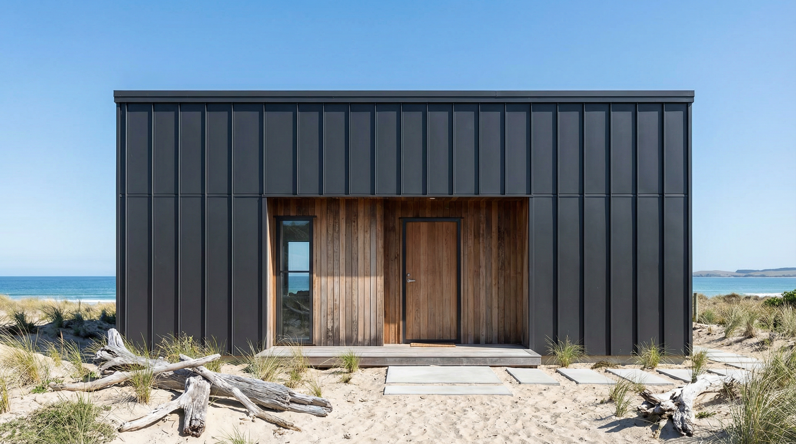

### Elewacja boczna długa (widokowa)

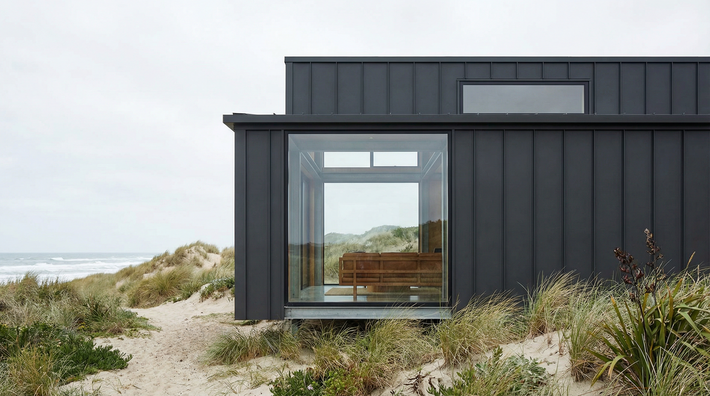

### Perspektywa zewnętrzna (3/4)

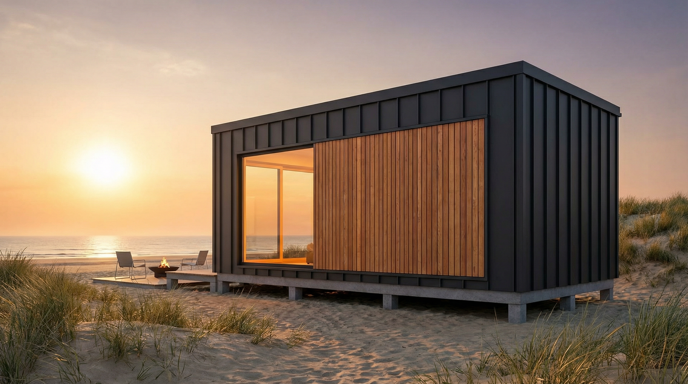

### Widok z lotu ptaka

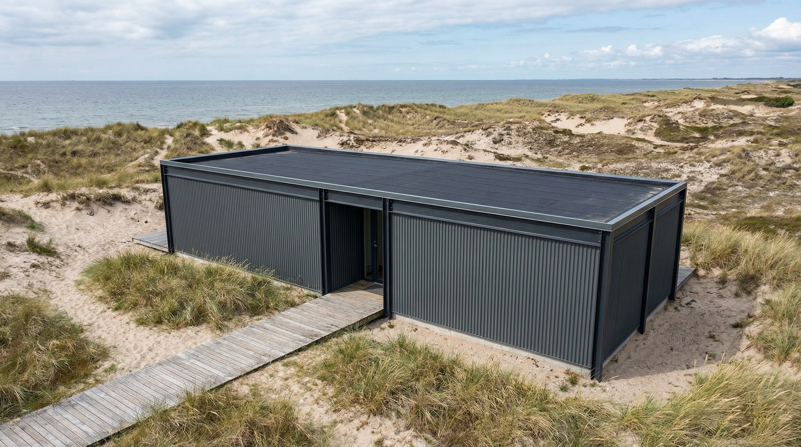

### Widok nocny

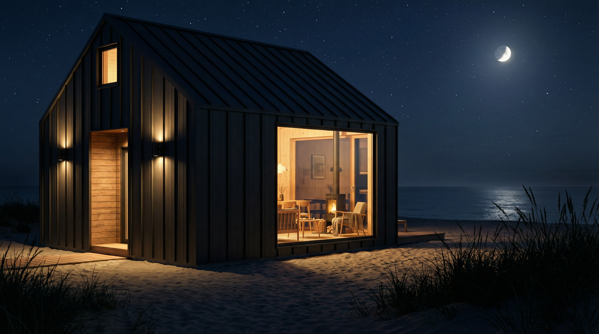

---

## 7. Wizualizacje realistyczne - Wnętrza {#wizualizacje-wnetrza}

### Strefa dzienna (salon)

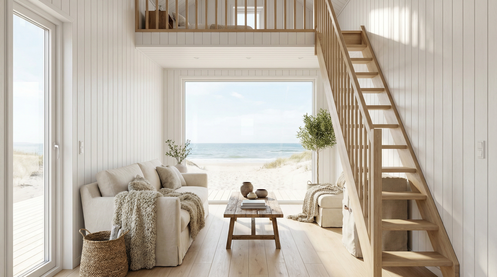

### Aneks kuchenny

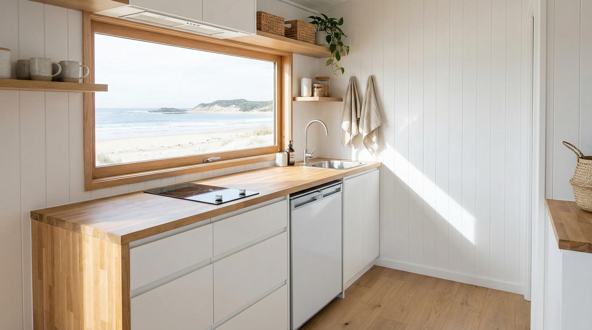

### Antresola - sypialnia

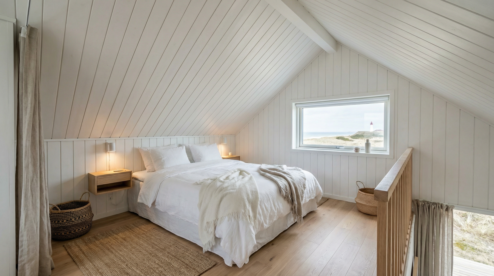

### Łazienka

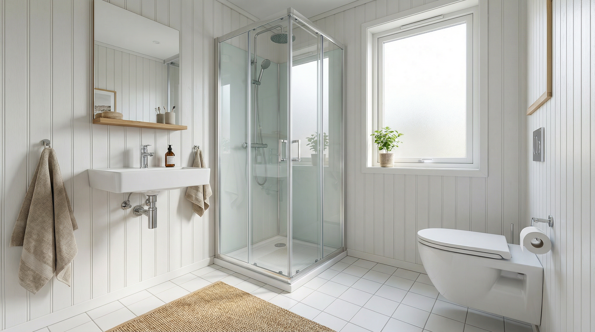

---

## 8. Schematy techniczne - Rzuty i przekroje {#schematy-techniczne}

### Rzut parteru (skala 1:50)

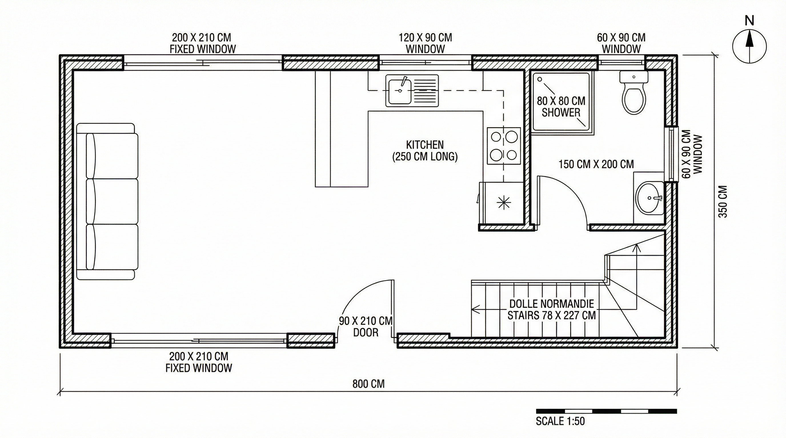

### Rzut antresoli (skala 1:50)

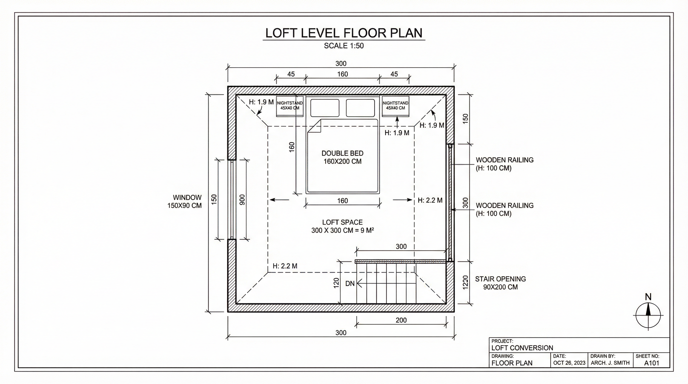

### Przekrój poprzeczny (skala 1:50)

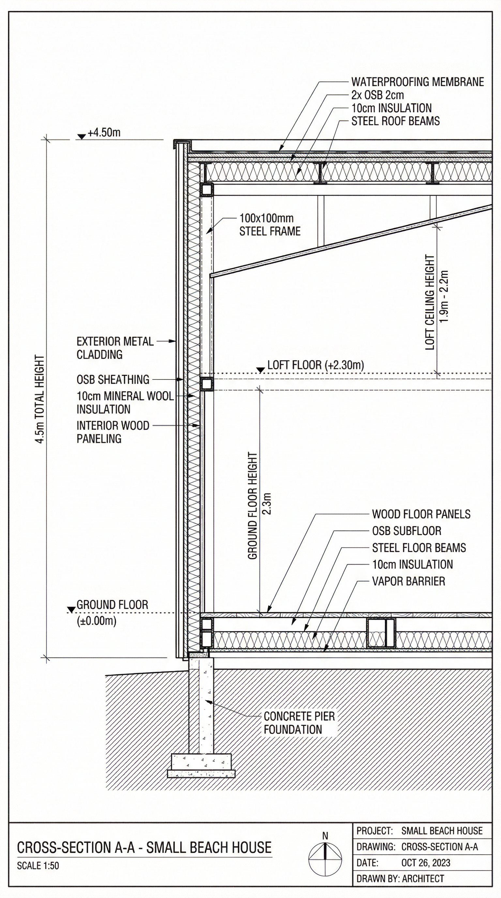

---

## 9. Schematy konstrukcyjne {#schematy-konstrukcyjne}

### Szkielet stalowy - widok izometryczny

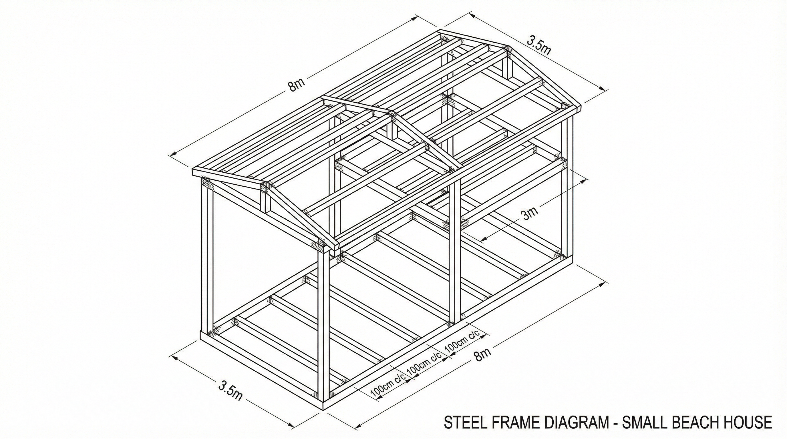

### Aksonometria budynku z rozłożeniem warstw

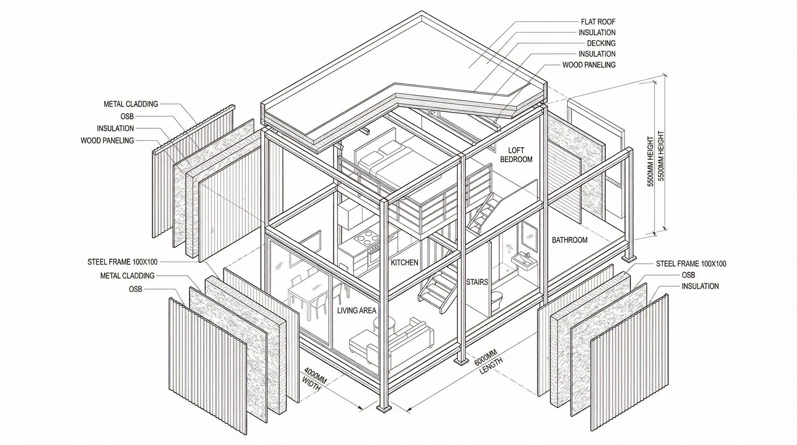

### Schemat eksplodowany - warstwy konstrukcyjne

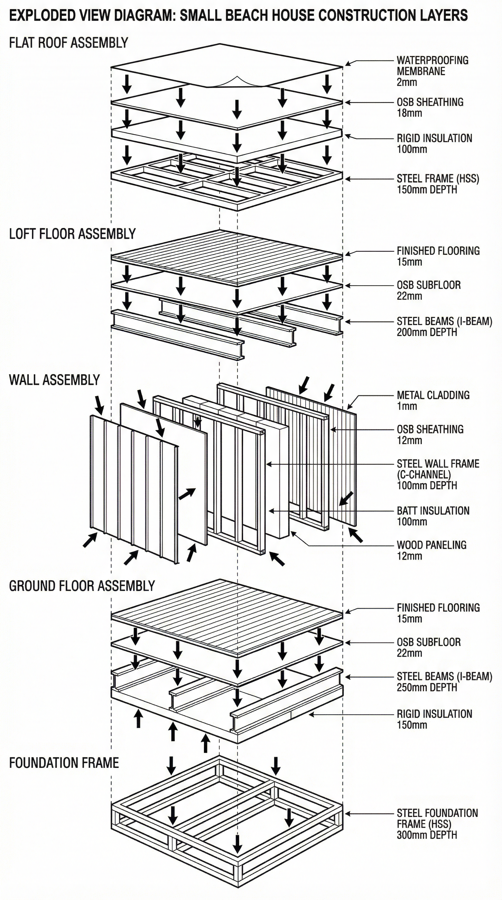

---

## 10. Opis architektoniczny i funkcjonalny {#opis-architektoniczny}

*Ta sekcja zawiera zaktualizowane opisy, uwzględniające poprawione wysokości i powierzchnie.*

Budynek charakteryzuje się prostą, prostopadłościenną bryłą o wymiarach 3,50 m × 8,00 m i wysokości **4,65 m**. Parter stanowi otwartą przestrzeń dzienną o wysokości **2,30 m**, a antresola o wymiarach 3,0 m × 3,0 m pełni funkcję sypialni z wysokością w świetle **ok. 1,90 m**.

---

## Podsumowanie końcowe

Niniejszy dokument stanowi kompletną, finalną wersję projektu architektonicznego. Projekt został zweryfikowany, uzupełniony o kluczowe obliczenia i wizualizacje. Dokumentacja jest gotowa do dalszych etapów realizacji inwestycji.
